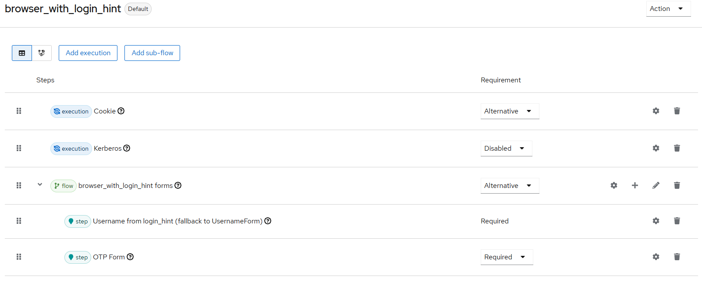

[open-issues]: https://github.com/it-at-m/keycloak-username-from-login-hint-authenticator-plugin/issues
[new-issue]: https://github.com/it-at-m/keycloak-username-from-login-hint-authenticator-plugin/issues/new/choose
[license]: ./LICENSE
[new-issue-shield]: https://img.shields.io/badge/new%20issue-blue?style=for-the-badge
[made-with-love-shield]: https://img.shields.io/badge/made%20with%20%E2%9D%A4%20by-it%40M-yellow?style=for-the-badge
[license-shield]: https://img.shields.io/github/license/it-at-m/refarch?style=for-the-badge
[itm-opensource]: https://opensource.muenchen.de/

# keycloak-username-from-login-hint-authenticator-plugin

[![New issue][new-issue-shield]][new-issue]
[![Made with love by it@M][made-with-love-shield]][itm-opensource]
[![GitHub license][license-shield]][license]

Plugin for extracting username from login_hint header

Authenticator that takes the username from the `login_hint` parameter and sets it in the context for later authentication using additional authenticators.
The authenticator falls back to the Username Form Authenticator if no `login_hint` is set.

**Attention:** Since this is basically a Username Form Authenticator, there always has to be another security check (TOTP etc.) in the flow.

## Built With

- OpenJDK 21
- Keycloak 26

## Deploy

Copy the file `username-from-login_hint-authenticator-X.X.X.jar` from the `target` directory (created after the build process)
to the Keycloak directory `providers`.

For Keycloak 26.3.x

## Configure

The authenticator is not configurable.

## Test

Can be tested as follows:
* Create new realm `muenchen.de`
* Create user test (no password needed)
* Authentication --> Browser flow
    * Dropdown "Action" --> Duplicate as `browser_with_login_hint`
    * Setup like this:
      
    * "Action" --> Bind flow
* Open in Browser `<base-url>/auth/realms/muenchen.de/account` --> Standard username form shows
* Change URL by adding `&login_hint=test` --> Username form is skipped and OTP page is shown
* Register OTP with smartphone app (FreeOTP etc.) and login with 2nd factor

## References

* https://github.com/keycloak/keycloak/blob/26.3.2/services/src/main/java/org/keycloak/authentication/authenticators/browser/UsernameForm.java
* https://github.com/keycloak/keycloak/blob/26.3.2/services/src/main/java/org/keycloak/authentication/authenticators/browser/UsernameFormFactory.java
* https://github.com/keycloak/keycloak/blob/26.3.2/services/src/main/java/org/keycloak/authentication/authenticators/browser/UsernamePasswordForm.java#L105

## Roadmap

See the [open issues][open-issues] for a full list of proposed features (and known issues).

## Contributing

Contributions are what make the open source community such an amazing place to learn, inspire, and create. Any contributions you make are **greatly appreciated**.

If you have a suggestion that would make this better, please open an issue with the tag "enhancement", fork the repo and create a pull request. You can also simply open an issue with the tag "enhancement".
Don't forget to give the project a star! Thanks again!

1. Open an issue with the tag "enhancement"
2. Fork the Project
3. Create your Feature Branch (`git checkout -b feature/AmazingFeature`)
4. Commit your Changes (`git commit -m 'Add some AmazingFeature'`)
5. Push to the Branch (`git push origin feature/AmazingFeature`)
6. Open a Pull Request

More about this in the [CODE_OF_CONDUCT](./.github/CODE_OF_CONDUCT.md) file.

## License

Distributed under the MIT License. See [LICENSE](LICENSE) file for more information.

## Contact

it@M - <opensource@muenchen.de>
